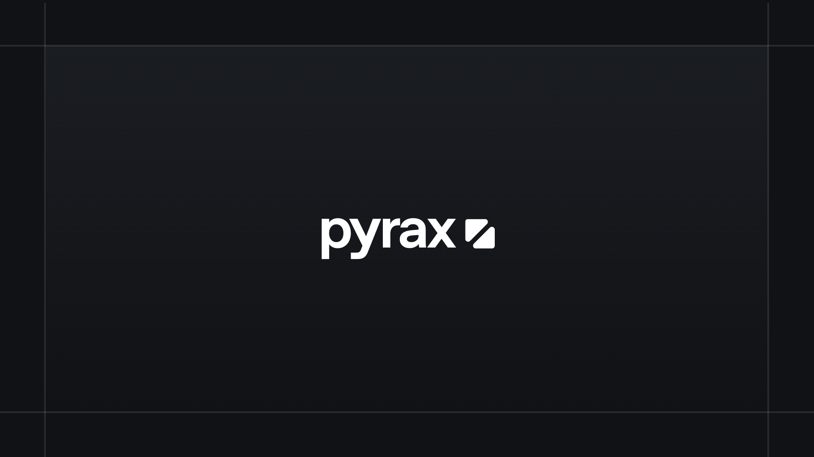

# Pyrax

This is the home page and soon to be customer dashboard for purchasing and getting support for pyrax products.

---

## TODO

- [x] Setup base application with api functions
- [x] Implement custom serverless functions 
- [x] Add ratelimiting
- [ ] Design and implement the database schema  
- [ ] Add user authentication and authorization  
- [ ] Implement rate limiting to prevent abuse  
- [ ] Implement a system for creating support tickets  
- [ ] Add real-time synchronization for support ticket messages  
- [ ] Implement user roles and permissions  
- [ ] Integrate payment processing  
- [ ] Allow customers to securely download their purchased products

---

Made with ❤️ by Fraser

📜 [License](LICENSE.md)

*Need help? Check the [Pyrax GitHub](https://github.com/Pyrax-OSS/Pyrax) for issues and discussions.*
